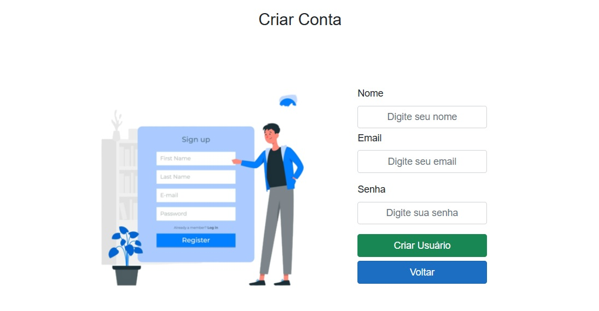
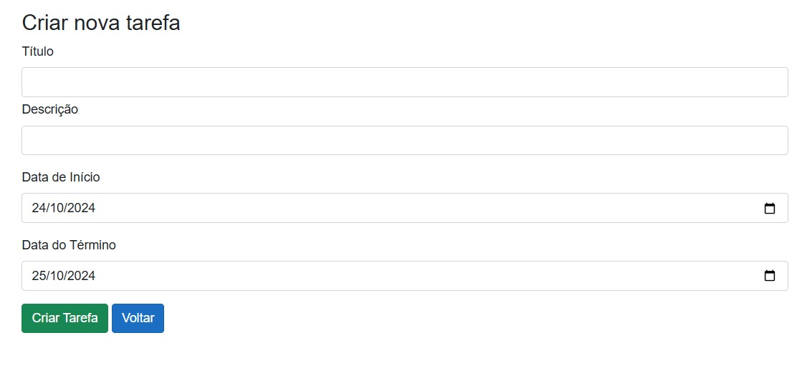
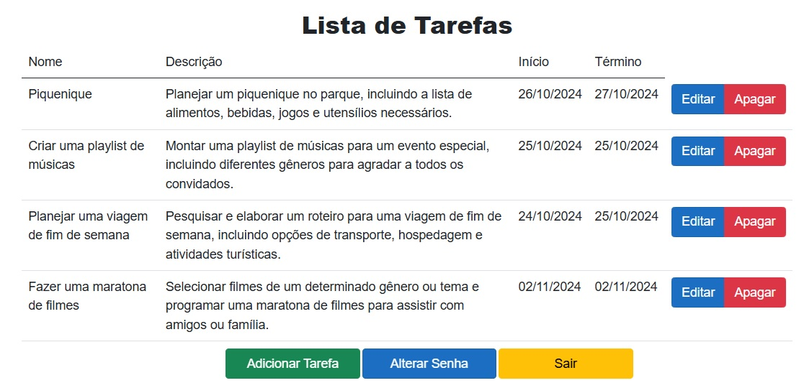
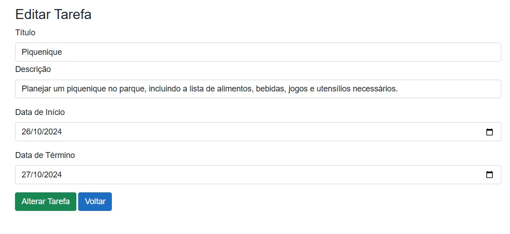
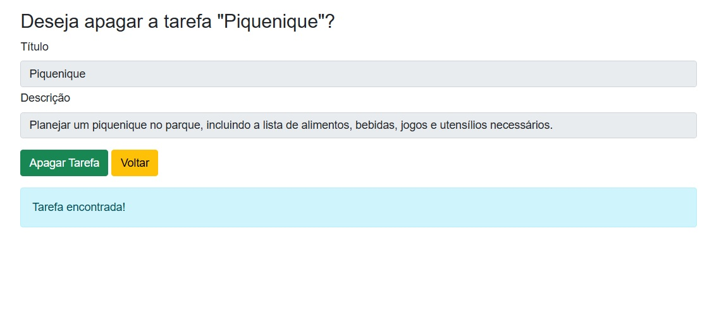
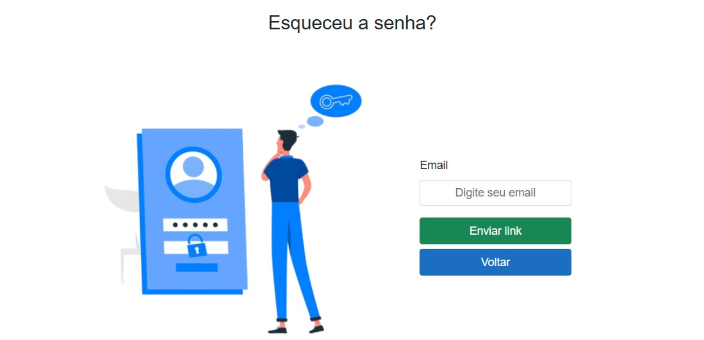
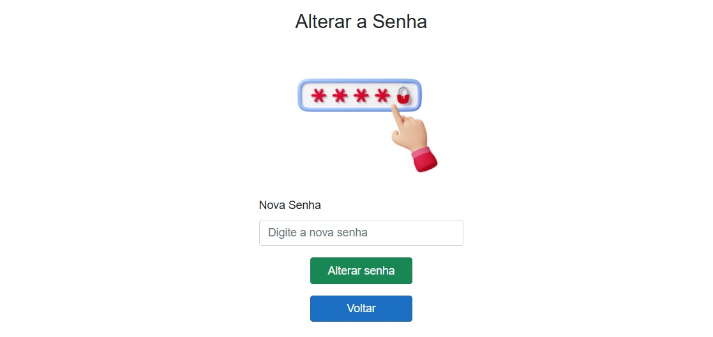

# Sistema de Tarefas em Blazor Full Stack .NET

## ✨ Introdução✨

Este projeto foi criado para testar meus conhecimentos no stack .NET. Nele, coloquei em prática conceitos como Domínios Ricos, DDD (Domain-Driven Design), autenticação utilizando JWT (JSON Web Tokens) e a comunicação entre o backend e o frontend utilizando apenas endpoints.

## ⚙️ Tecnologias Utilizadas:

- **Frontend**: Blazor Server
- **Backend**: .NET Framework
- **Banco de Dados**: MySql
- **Documentação**: Swagger

## 📖 Documentação

A documentação da API está disponível no Swagger, facilitando a visualização e o teste dos endpoints.

## 📸 Screenshots

|  |  |
| :------------------------------------------: | :----------------------------------------- |

|  |  |
| :------------------------------------------------: | :-----------------------------------------------------: |

|  |  |
| :-----------------------------------------------------: | :-------------------------------------------------------: |

|  |  |
| :-----------------------------------------------------------: | :-----------------------------------------------------------: |

## Licença

-**Suporte**
Para suporte ou feedback, entre em contato via WhatsApp: +55 (61) 99835-4398 (https://wa.me/5561998354398) ou pelo email: lyncoln_erc@hotmail.com

---

2024 | Desenvolvido por Emerson Ribeiro
